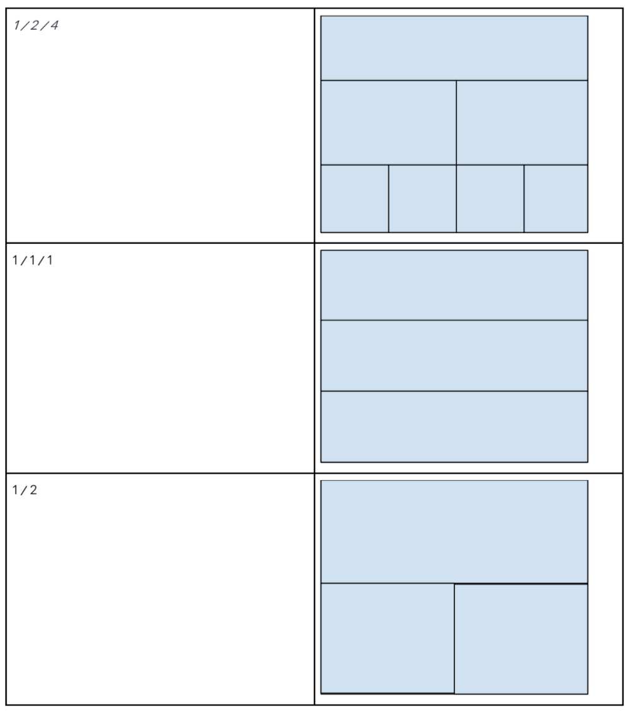

# Layout Generator

## Project Description

You are going to implement a "Layout Generator". The input and output of your generator are as follows:

**Input**: A string like `"1 / 1 / 2"`. The number presents the number of items in a `row`.

**Output**: a layout based on the given value.

You should put the layout generator inside of a container that has a text input with layout-values. When the
user types a valid value, the layout will change in real-time. The inputs can be of infinite rows.

## Examples

